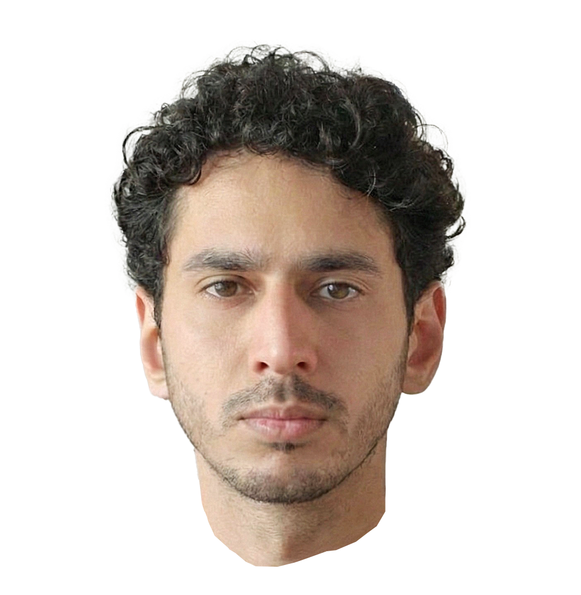

# Dotted Self Portrait

An interactive p5.js sketch that creates a dotted portrait effect from any image with a transparent background. The sketch uses a random walk algorithm to progressively fill the portrait with dots, followed by an "alive mode" that continuously adds subtle details.



## Credits

This project is an altered version of [Generated p5.js Portraits](https://github.com/stihilus/Generated-p5js-Portraits) by stihilus, originally based on work from [www.lomz.net - 2019](https://www.lomz.net).

**Key modifications:**
- Added interactive parameter controls
- Implemented two-phase rendering (initial fill + alive mode)
- Added color mixing and transparency detection
- Settings persistence with localStorage
- Performance optimizations for web deployment

## Features

- **Two-Phase Rendering:**
  - Initial fill: Random walk algorithm creates the portrait progressively
  - Alive mode: Continues adding small random dots for a "living" effect

- **Interactive Controls:**
  - Adjust dot size, density, and speed in real-time
  - Toggle between original image colors and solid color
  - Color mixing for artistic effects
  - Save/load your favorite settings

- **Performance Optimized:**
  - Uses CDN for p5.js library
  - Optimized pixel operations
  - Auto-pause feature to save CPU after completion

## Setup Instructions

### 1. Prepare Your Image

Your image should:
- Be a **PNG file with transparent background** (recommended)
- Have dimensions around **1000x1000 pixels** for best results
- Be named `portrait.png`

**How to create a transparent background:**
- Use tools like [remove.bg](https://www.remove.bg/) to remove backgrounds automatically
- Or use Photoshop, GIMP, or any image editor that supports transparency

### 2. Add Your Image

1. Place your `portrait.png` file in the `assets/` folder
2. The sketch will automatically use this image

### 3. Run the Project

You have two options:

#### Option A: Simple Python Server (Recommended)
```bash
# Navigate to the project folder
cd dotted-self-portrait

# Start a local server (Python 3)
python -m http.server 8000

# Or if you have Python 2
python -m SimpleHTTPServer 8000
```

Then open your browser to:
- **Editor (with controls):** `http://localhost:8000/editor.html`
- **Simple viewer:** `http://localhost:8000/viewer.html`
- **Basic version:** `http://localhost:8000/index.html`

#### Option B: Live Server Extension
If you use VS Code, install the "Live Server" extension and click "Go Live"

## File Structure

```
dotted-self-portrait/
├── assets/
│   └── portrait.png          # Your portrait image (add yours here!)
├── editor.html               # Full version with interactive controls
├── viewer.html               # Clean viewing version
├── index.html                # Basic version
├── sketch-editor.js          # Main interactive sketch
├── sketch.js                 # Simple sketch for viewer/index
├── style.css                 # Basic styles
└── README.md                 # This file
```

## Usage

### Editor Version (Recommended)

Open `editor.html` for the full experience with controls:

1. **Initial Fill Phase:**
   - Watch as dots randomly walk from the center to fill the portrait
   - Adjust "Initial Dots per Frame" for faster/slower filling
   - Set "Max Total Dots" limit (1,000 - 80,000)

2. **Alive Mode:**
   - After reaching max dots, switches to alive mode automatically
   - Adds small random dots continuously for 10 seconds
   - Creates a subtle "living" effect

3. **Customize:**
   - Adjust dot sizes, colors, and opacity
   - Toggle between image colors and solid color
   - Mix colors for artistic effects
   - Save your favorite settings as default

4. **Reset:**
   - Press "Reset Canvas" or press `R` key to start over

### Controls Explained

**Main Controls:**
- **Initial Dots per Frame:** How many dots to draw each frame (speed)
- **Max Total Dots:** When to switch from fill mode to alive mode

**Alive Mode:**
- **Alive Speed:** Dots per frame in alive mode
- **Alive Max/Min Dot Size:** Size range for alive mode dots

**Initial Fill Settings:**
- **Max/Min Dot Size:** Size range based on brightness
- **Random Walk Range:** How far each step can move
- **Transparency Threshold:** Ignore pixels below this alpha value
- **Dot Opacity:** Transparency of drawn dots
- **Brightness Sensitivity:** How brightness affects dot size
- **Color Mix Amount:** Blend between solid color and image colors

**Colors:**
- **Dot Color:** Base color for solid color mode
- **Background Color:** Canvas background
- **Use Image Colors / Use Solid Color:** Toggle button

## Tips for Best Results

1. **Image Preparation:**
   - Clean transparent background works best
   - High contrast images produce more dramatic effects
   - Portrait-style images work better than full-body shots

2. **Parameter Tuning:**
   - Start with default settings and adjust gradually
   - Lower max total dots (20,000-40,000) for faster renders
   - Higher dots per frame = faster but less detailed
   - Increase brightness sensitivity for more size variation

3. **Artistic Effects:**
   - Use solid color with transparency for silhouette effect
   - Mix colors partially (0.3-0.5) for stylized look
   - Increase alive mode size for visible texture overlay

4. **Performance:**
   - Keep max total dots under 80,000 for web deployment
   - Lower dot counts if running on slower devices
   - Auto-pause kicks in after 10 seconds in alive mode

## Keyboard Shortcuts

- **R:** Reset canvas and restart rendering

## Technical Details

**Library:** p5.js (v1.7.0 via CDN)
**Canvas Size:** 640 x 654 pixels (default)
**Pixel Density:** 2 (for retina displays)
**Storage:** Settings saved to browser localStorage

## Troubleshooting

**Image not appearing:**
- Make sure `portrait.png` exists in `assets/` folder
- Check browser console for error messages
- Ensure image has transparent background (alpha channel)

**Performance issues:**
- Lower "Max Total Dots" setting
- Decrease "Initial Dots per Frame"
- Reduce pixel density in code if needed

**Settings not saving:**
- Check if browser allows localStorage
- Try different browser if issues persist

## License

This project builds upon open-source work. Please credit both:
- Original: [Generated p5.js Portraits](https://github.com/stihilus/Generated-p5js-Portraits) by stihilus
- Based on: [www.lomz.net - 2019](https://www.lomz.net)

## Contributing

Feel free to fork this project and add your own modifications! Some ideas:
- Additional rendering modes
- Export/save image functionality
- Different random walk algorithms
- Animation recording

---

**Made with p5.js** | [Documentation](https://p5js.org/reference/)
