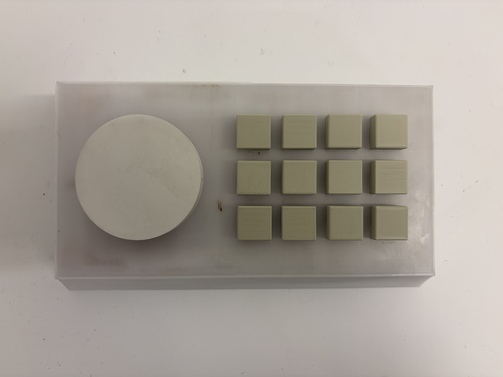

# VOID MACHINE

**An experimental noise synthesizer with WebGL visualizer and physical controller support**

VOID MACHINE is a browser-based industrial noise instrument that combines generative audio synthesis with reactive WebGL visuals, optionally controlled by a custom hardware interface built with a Raspberry Pi Pico.



---

## Overview

The system consists of three interconnected components:

1. **Audio Engine** — Web Audio API-based synthesizers producing noise textures, distorted scream voices, and industrial percussion
2. **Visual Engine** — WebGL shader-driven visualizer using feedback loops, cellular automata patterns, and VHS-style effects
3. **Hardware Controller** — A 3×4 button matrix with potentiometer, interfacing via Web Serial API

---

## Hardware Controller

### Components

- Raspberry Pi Pico (or Pico W)
- 12× tactile switches (momentary push buttons)
- 12× 1N4148 diodes (for matrix scanning)
- 1× 10kΩ potentiometer
- Perfboard/PCB for assembly

### Matrix Wiring

The controller uses a **3-row × 4-column scanning matrix** with diodes to prevent ghosting when multiple buttons are pressed simultaneously.


```
                    COLUMNS (Active-Low Read)
                    GP8    GP7    GP6    GP5
                    Col1   Col2   Col3   Col4
                     │      │      │      │
         ┌───────────┼──────┼──────┼──────┼────
         │           │      │      │      │
GP2 Row1 ●──┬──o ◄───┼──┬──o──┼──┬──o──┼──┬──o
         │  │ ┴D1│   │  │ ┴D2│  │ ┴D3│  │ ┴D4
         ├──│────│───├──│────│──┼──│────│──┼──│
         │  │    │   │  │    │  │  │    │  │  │
GP3 Row2 ●──┬──o ◄───┼──┬──o──┼──┬──o──┼──┬──o
         │  │ ┴D5│   │  │ ┴D6│  │ ┴D7│  │ ┴D8
         ├──│────│───├──│────│──┼──│────│──┼──│
         │  │    │   │  │    │  │  │    │  │  │
GP4 Row3 ●──┬──o ◄───┼──┬──o──┼──┬──o──┼──┬──o
            │ ┴D9│      │┴D10│    │┴D11│    │┴D12
         
         D = Diode (cathode/black band facing row)
         o = Button
```

### Pin Assignment

| Function | GPIO Pin | Notes |
|----------|----------|-------|
| Row 1 | GP2 | Active-low output |
| Row 2 | GP3 | Active-low output |
| Row 3 | GP4 | Active-low output |
| Column 1 | GP8 | Input with internal pull-up |
| Column 2 | GP7 | Input with internal pull-up |
| Column 3 | GP6 | Input with internal pull-up |
| Column 4 | GP5 | Input with internal pull-up |
| Potentiometer | GP28 (ADC2) | 10-bit analog input (0-1023) |

### Scanning Algorithm

1. Set all rows HIGH (inactive)
2. For each row:
   - Drive the row LOW
   - Read all column pins (pressed = LOW due to pull-ups)
   - Apply 20ms debounce per button
   - Set row back HIGH
3. Map physical position to button number using the `buttonMap[row][col]` lookup table

### Diode Orientation

Diodes are placed with the **cathode (black band) facing the row** wire. This allows current to flow from column to row when a button is pressed, but prevents current from flowing between columns when multiple buttons are pressed.

### Serial Protocol

The Pico sends plain-text serial messages at 115200 baud:
```
Button 5 PRESSED
Button 5 RELEASED
Potentiometer (GP28): 512 / 1023  (50%)
```

The web interface parses these messages via the Web Serial API to trigger synth events.

---

## Audio Engine

### Architecture

```
┌─────────────┐   ┌─────────────┐   ┌─────────────┐
│  Noise Gen  │   │   Formant   │   │    Drum     │
│  (White,    │   │   Scream    │   │  Synthesis  │
│  Pink,Brown)│   │   Voices    │   │             │
└──────┬──────┘   └──────┬──────┘   └──────┬──────┘
       │                 │                 │
       └────────┬────────┴────────┬────────┘
                │                 │
         ┌──────▼──────┐   ┌──────▼──────┐
         │   Master    │   │   Reverb    │
         │   Filter    │   │  (Convolver)│
         └──────┬──────┘   └──────┬──────┘
                │                 │
         ┌──────▼──────┐          │
         │   WaveShaper│◄─────────┘
         │  (Distortion)│
         └──────┬──────┘
                │
         ┌──────▼──────┐
         │  Compressor │
         └──────┬──────┘
                │
         ┌──────▼──────┐
         │    Output   │
         └─────────────┘
```

### Synth Types

#### Noise Synths (Buttons 1-4)
| Button | Name | Noise Type | Band Filter | Distortion |
|--------|------|------------|-------------|------------|
| 1 | SCREECH | White | 1200 Hz, Q=12 | 100 |
| 2 | RUMBLE | Pink | 250 Hz, Q=8 | 60 |
| 3 | SHRED | White | 3000 Hz, Q=18 | 200 |
| 4 | DRONE | Brown | 100 Hz, Q=4 | 40 |

Each noise synth uses:
- **Noise buffer source** (looped)
- **Bandpass filter** with LFO modulation
- **WaveShaper distortion**
- **Low-pass filter** for warmth
- **Peaking EQ** for presence

#### Scream Voices (Buttons 5-8)
| Button | Name | Base Pitch | Noise Mix | Character |
|--------|------|------------|-----------|-----------|
| 5 | GROWL | 65 Hz | 35% | Deep, guttural |
| 6 | GUT | 90 Hz | 40% | Mid-range punch |
| 7 | BARK | 120 Hz | 45% | Aggressive attack |
| 8 | SCREAM | 155 Hz | 50% | High, piercing |

Scream voices use **formant synthesis**:
- 5 parallel bandpass filters emulating vocal formants
- 3-stage distortion chain (asymmetric clipping → hard clipping → soft saturation)
- ADSR envelope with slow attack for "swell" effect
- Dedicated reverb send

#### Drums/FX (Buttons 9-12)
| Button | Name | Duration | Technique |
|--------|------|----------|-----------|
| 9 | KICK | 3.5s | Multi-oscillator with exponential pitch sweep |
| 10 | DETONATE | 2.5s | Filtered noise burst with metallic transient |
| 11 | SLAM | 1.5s | Mid-frequency punch with harmonic layers |
| 12 | CATACLYSM | 3s | Chaos engine with random modulation |

### Interaction Modes

- **Tap** — Momentary trigger (active while held)
- **Double-tap** — Latch mode (stays on until tapped again)
- **Potentiometer** — Controls master filter cutoff (mapped to visual intensity)

---

## Visual Engine

### Conceptual Framework

The visualizer operates as a **visual feedback system** inspired by:

- **Cellular automata** (Von Neumann neighborhood rules)
- **Analog video feedback** (recursive frame processing)
- **VHS degradation** (scanlines, chromatic aberration, glitch tears)

Each audio event maps to a visual disturbance that propagates through the feedback buffer, creating organic, emergent patterns.

### Technical Implementation

#### Rendering Pipeline

```
┌─────────────────────────────────────────────┐
│              PING-PONG BUFFERS              │
│  ┌──────────┐           ┌──────────┐        │
│  │  Ping    │◄─────────►│  Pong    │        │
│  │  Texture │           │  Texture │        │
│  └──────────┘           └──────────┘        │
└───────────────────┬─────────────────────────┘
                    │
                    ▼
           ┌────────────────┐
           │ Fragment Shader │
           │   (per-pixel)   │
           └────────┬───────┘
                    │
        ┌───────────┼───────────┐
        ▼           ▼           ▼
   ┌─────────┐ ┌─────────┐ ┌─────────┐
   │Feedback │ │Cellular │ │  Synth  │
   │  Layer  │ │Automata │ │ Overlays│
   └─────────┘ └─────────┘ └─────────┘
```

#### Shader Components

1. **Feedback Layer**
   - Reads previous frame with slight UV offset (drift/roll)
   - Applies persistence (0.85-0.89) and decay
   - Chromatic aberration based on distortion amount

2. **Cellular Automata Field**
   - 40×40 cell grid using Von Neumann neighborhood
   - Threshold rules modulated by noise/drone intensity
   - Signal propagation waves traveling in cardinal directions

3. **Synth Overlays** (driven by button envelopes)
   - SCREECH → Horizontal tear lines with gaps
   - RUMBLE → Vertical displacement waves
   - SHRED → Rotating radial cuts
   - DRONE → FBM noise field with breathing modulation
   - Scream voices → Ring/grid/spiral patterns
   - Drums → Expanding rings, slice glitches, explosions

4. **VHS Effects** (CSS-only)
   - Scanline overlay using `repeating-linear-gradient`
   - Vignette using `radial-gradient`
   - Screen shake via CSS animations (`transform: translate`)
   - Glitch tear using `clip-path` animation

### Uniform Bindings

| Uniform | Source | Effect |
|---------|--------|--------|
| `u_e1` - `u_e4` | Noise envelopes | Synth-specific visual layers |
| `u_d1` - `u_d4` | Scream envelopes | Voice-specific patterns |
| `u_kick`, `u_snare`, `u_crash`, `u_cata` | Drum triggers | Impact effects |
| `u_noise`, `u_drone`, `u_drum` | Accumulated levels | Global feedback modulation |
| `u_pot` | Potentiometer | Brightness/zoom macro |
| `u_distort` | Calculated | Chromatic aberration amount |
| `u_flash` | Drum hits | Screen flash intensity |

---

## Running the Project

### Browser Only (No Hardware)

1. Open `index.html` in a modern browser (Chrome/Edge recommended)
2. Click anywhere to start audio context
3. Use keyboard controls:
   - `1-4` → Noise synths
   - `Q W E R` → Scream voices  
   - `A S D F` → Drums/FX
   - Double-tap any key to latch

### With Hardware Controller

1. Flash `matrix controller.ino` to your Pico using Arduino IDE
2. Connect Pico via USB
3. Open the web interface
4. Click "CONNECT" and select the Pico's serial port
5. Press physical buttons to trigger synths

---

## Files

| File | Description |
|------|-------------|
| `index.html` | Main application (audio + visuals + UI) |
| `matrix controller.ino` | Arduino sketch for Pico button matrix |
| `App.tsx` | React component version (alternative UI) |
| `audio-engine.ts` | TypeScript audio engine module |

---

## Browser Compatibility

- **Chrome/Edge**: Full support (Web Serial + WebGL)
- **Firefox**: No Web Serial (keyboard-only mode)
- **Safari**: Limited WebGL features

---

## License

MIT License — Free to use, modify, and distribute.

---

*Part of the [Communicative Objects](https://kalharbi11.github.io/Communicative-Objects/) project.*
